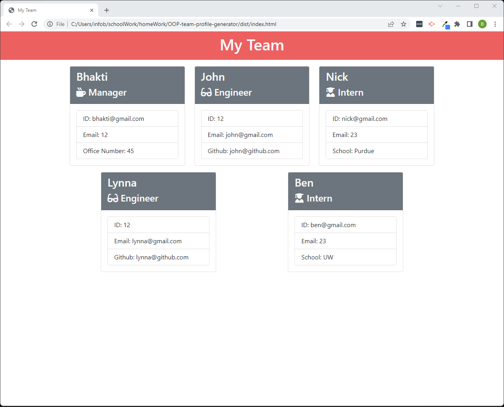

# OOP-team-profile-generator


## Description:
A team profile is generated when "node index.js" command is called in the terminal window. This is done by asking a series of questions to the user regarding the role of employee, their name, id, email and other attributes. The responses provided by user are used to create contents of the index,html file.

## Table of Contents:

-  [Description](#description)

-  [Installation Instructions](#installation)

-  [Video](#video)

-  [Screenshots](#screenshot)

-  [Example](#example)

-  [Questions](questions)

## Installation Instructions:
* The `.gitignore` file includes `node_modules/` and `.DS_Store/`

* The `.gitignore` file does not include `dist` so Git will track this folder

* The application includes `Employee`, `Manager`, `Engineer`, and `Intern` classes. The tests for these classes are in the `_tests_` directory.

* This application uses [Jest](https://www.npmjs.com/package/jest) for running the unit tests and [Inquirer](https://www.npmjs.com/package/inquirer) for collecting input from the user. The application will be invoked by using the following command:
```bash
node index.js
//Tests can be run with following command:
nmp run test
```

## Video:
* [Demonstration of the team profile generator and tests](https://youtu.be/YVBs1fJHVyY)

## Screenshots:





## Example:
The example/sample index.html file can be found at ./dist folder

## Questions:
For additional questions, reach out to me:

Github: https://github.com/bkhandag

Email: khandagale.b.g@gmail.com